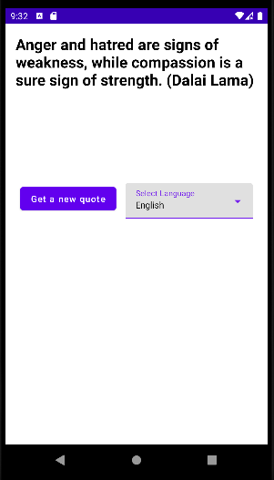
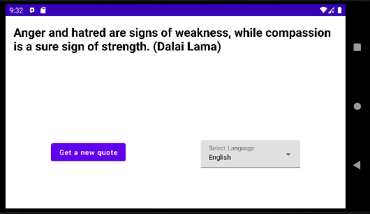
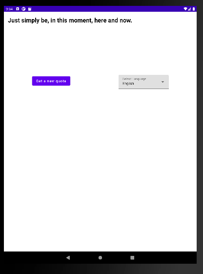
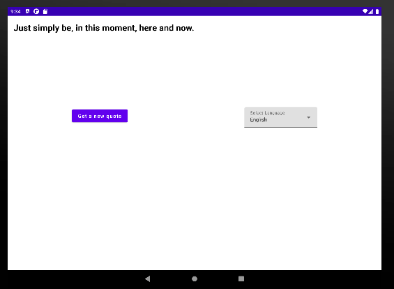

# Overview

Android take home assignment for 7Mind

# Screenshots

* Pixel 2

    
    

* Nexus 9

    
    

# Technology stack

* MVVM + Clean Architecture
* Coroutines, Flow
* Hilt
* Retrofit 2
* Jetpack Compose, Navigation Compose
* UI Test / Unit Test using Mockito
* [pinterest/ktlint](https://github.com/pinterest/ktlint) for styling

# How to run the app

* Android Studio > Select "app" on Run/Debug configuration > Click Run icon 

# How to run UI test

* Android Studio > Click "app/src/androidTest/java/com.github.hachimori.samplequoteapplication" on Project pane > Right click and select "Run Tests in ..."

* ⚠️ Remarks: there's a report that using Mockito on non-64 bit devices caused random crashing ⚠️
  * So, please use x86_64 emulator in running tests.
  * Reference:
    * https://github.com/mockk/mockk/issues/466#issuecomment-743264258

# How to run Unit test

* Android Studio > Click "app/src/test/java/com.github.hachimori.samplequoteapplication" on Project pane > Right click and select "Run Tests in ..."

